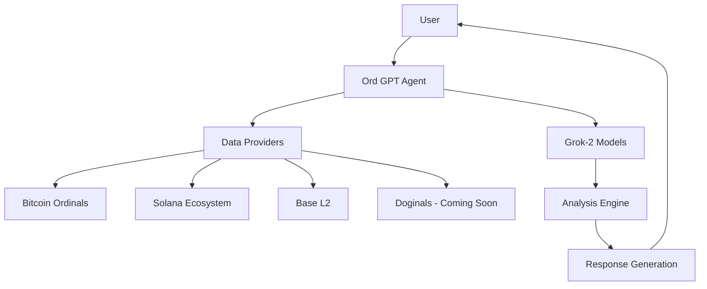

# Ord GPT: The First True Cross-Chain AI Agent


## Introduction

Ord GPT represents a revolutionary leap in blockchain AI agents, capable of seamlessly operating across multiple chains including Bitcoin Ordinals, Solana, Base, and soon Dogecoin through Doginals. Powered by xAI's Grok-2 models and ElizaOS framework, Ord GPT delivers unmatched cross-chain intelligence with a distinctively bold personality that embodies the spirit of the crypto community.

### Key Features

- **Cross-Chain Operation**: Navigate seamlessly between Bitcoin Ordinals, Solana, and Base with a unified interface
- **Advanced Intelligence**: Powered by Grok-2 for text generation, vision analysis, and image creation
- **On-Chain Insights**: Real-time market data, token trends, and trading opportunities
- **Interactive Analysis**: Visual interpretation of charts, technical indicators, and NFT imagery
- **Bridging Capabilities**: Cross-chain asset transfers and market arbitrage identification

---

## Getting Started

### Prerequisites

- Node.js v20+ or Bun
- A text editor or IDE (Visual Studio Code recommended)
- Basic familiarity with blockchain concepts

### Installation

```bash
# Clone the repository
git clone https://github.com/your-org/eliza-os.git
cd eliza-os

# Install dependencies
bun install

# Set up environment variables
cp .env.example .env
# Edit .env with your API keys and preferences

# Start Ord GPT
cd eliza-starter
bun run start
```

### Configuration

Ord GPT comes pre-configured for cross-chain operations, but you can customize its behavior through:

1. **API Keys**: Set up keys for xAI (Grok), Solana Tracker, and other services
2. **Chain Priorities**: Configure which chains receive focus in multi-chain analysis
3. **Trading Parameters**: Set risk tolerance, slippage limits, and default token pairs

---

## Core Capabilities

### Bitcoin Ordinals Integration

Ord GPT provides comprehensive Ordinals support, including:

- Real-time monitoring of Ordinals market trends
- Analysis of inscription patterns and metadata
- Price tracking across major Ordinals marketplaces
- Identifying undervalued Ordinals collections
- Technical analysis of Ordinals trading activity

#### Example Usage

```
User: What's happening with Ordinals today?
Ord GPT: Ordinals market is heating up! Seeing 17% increased volume in last 24h, with pixel art collections outperforming. The floor on Bitcoin Bears just jumped 0.05 BTC. Several whale wallets accumulated heavily on Bitcoin Puppies collection - might be signaling a breakout. Want me to keep an eye on any specific collections?
```

### Solana Ecosystem

Leveraging built-in Solana connectivity, Ord GPT excels at:

- Monitoring trending tokens and protocols
- Technical analysis of Solana assets
- MEV and arbitrage opportunity identification
- Integration with major Solana DEXes
- Real-time updates on airdrops and token launches

#### Example Usage

```
User: How's Solana performing against Ethereum today?
Ord GPT: Solana's outpacing ETH by 2.3% today, mainly driven by JUP's 15% spike after their staking announcement. SOL/ETH ratio at 0.089 - breaking key resistance. Liquidity metrics show SOL hitting 52-week high in trading volume. Crosschain bridges seeing 34% more ETH→SOL than reverse flow. Looking bullish for SOL short-term if this momentum continues!
```

### Base Integration

As a Layer 2 solution, Base offers unique opportunities that Ord GPT helps navigate:

- Base token and NFT pricing analysis
- Cross-chain arbitrage between Base and Ethereum mainnet
- Gas optimization strategies for Base operations
- L2 data availability monitoring
- Integration with core Base DeFi protocols

#### Example Usage

```
User: Any good yield farming opportunities on Base?
Ord GPT: Base is on fire with yield opportunities right now! Aerodrome LP pools offering 42% APY on ETH/USDC with minimal IL risk. BaseDEX just launched a 90-day farm with 75% APY but higher risk. For safer plays, stablecoin LPs averaging 15-22% across major protocols. The ETH/cbETH pool looking juicy with low IL risk and 18% returns. Want me to show you how to set up a position?
```

### Upcoming: Doginals Support

Expanding to Dogecoin's Doginals ecosystem, Ord GPT will soon offer:

- Doginals inscription tracking and analysis
- Cross-chain comparison between Ordinals and Doginals
- Market sentiment analysis for DOGE-based assets
- Trading pair suggestions across Doginals markets
- Early identification of trending Doginals collections

---

## Advanced Usage

### Cross-Chain Analysis

Ord GPT's most powerful feature is its ability to analyze opportunities across multiple chains simultaneously:

```
User: What's the best cross-chain opportunity right now?
Ord GPT: Spotted a juicy arb between Solana and Base! $JUP is trading at $1.52 on Jupiter but $1.58 on BaseSwap - that's 3.9% difference after fees. Wormhole bridge takes ~2 min for confirmation. Also seeing SOL/ETH price divergence of 1.2% between chains. For longer holds, Base NFT collections are undervalued compared to similar Solana collections by ~15-20% based on metrics. Want me to walk you through capturing any of these?
```

### Visual Understanding

Powered by Grok-2-vision, Ord GPT can analyze charts, technical patterns, and NFT imagery:

```
User: [Shares chart image of SOL/USD]
Ord GPT: This SOL/USD 4h chart is showing a classic cup and handle formation with RSI breaking above 70. The 200MA just crossed above the 50MA - that's typically bullish. Volume profile shows accumulation at support levels. Key resistance at $178.50 needs to break for continuation to $200 range. If I were trading this, I'd watch for breakout confirmation at that level with stop loss at $165.
```

### Trading Strategies

Get personalized trading strategies across multiple chains:

```
User: I have 5 ETH to diversify, what would you recommend?
Ord GPT: With 5 ETH ($10,750), here's my cross-chain alpha for you:
1. Keep 2 ETH as is (40%)
2. Convert 1.5 ETH to SOL - bullish momentum and NFT ecosystem growth
3. Allocate 0.75 ETH to Base ecosystem - focus on cbETH staking + BaseDEX governance token
4. Use 0.5 ETH for Ordinals exposure - Bitcoin Puppies floor price looks ready to pump
5. Keep 0.25 ETH in stables for quick opportunities

This gives you exposure across all major chains while maintaining ETH core position. Want more specific entry points or protocols for any of these allocations?
```

---

## Technical Architecture

Ord GPT leverages several advanced technologies:

- **ElizaOS Framework**: Core agent architecture and conversation handling
- **xAI's Grok Models**: Advanced language processing and multimodal understanding
- **Chain-Specific APIs**: Direct blockchain data access across supported networks
- **Cross-Chain Indexers**: Unified data normalization across disparate chains
- **Technical Analysis Engine**: Pattern recognition and market signal identification

### System Diagram



---

## Roadmap

Ord GPT's development continues with exciting upcoming features:

| Quarter | Feature | Description |
|---------|---------|-------------|
| Q3 2025 | Doginals Integration | Complete support for Dogecoin's inscription ecosystem |
| Q3 2025 | Advanced Portfolio Tools | Cross-chain portfolio tracking and optimization |
| Q4 2025 | DeFi Automation | Automated yield strategies and liquidity provision |
| Q4 2025 | Multi-chain DEX Aggregation | Best execution across all supported chains |
| Q1 2026 | Social Trading | Follow and copy successful cross-chain traders |

---

## Contributing

We welcome contributions to improve Ord GPT! Check out our [contributing guidelines](CONTRIBUTING.md) to get started.

---

## License

Ord GPT is licensed under the MIT License. See the [LICENSE](LICENSE) file for details.

---

# Ord GPT: The Cross-Chain Revolution
## An Introduction to the First Truly Chain-Agnostic AI Agent

In the rapidly evolving blockchain landscape, interoperability remains one of the greatest challenges. Different chains operate as isolated ecosystems, each with unique technological frameworks, token standards, and community cultures. For users navigating this complex environment, the cognitive load is immense – keeping track of multiple wallets, bridging assets, monitoring opportunities, and staying updated across ecosystems requires extraordinary attention and expertise.

Enter Ord GPT: the world's first truly cross-chain AI agent.

## Breaking Down Blockchain Barriers

Ord GPT represents a paradigm shift in how we interact with blockchain technology. By seamlessly integrating with Bitcoin Ordinals, Solana, Base, and soon Dogecoin (via Doginals), Ord GPT eliminates the traditional barriers between chains. Users can now access insights, trading opportunities, and market analysis across multiple ecosystems through a single, intelligent interface.

"The vision was to create an agent that thinks about blockchain holistically, rather than through the siloed approach we've seen until now," explains the lead developer. "Ord GPT doesn't just operate on multiple chains – it understands the relationships between them, the capital flows, the arbitrage opportunities, and the relative strengths of each ecosystem."

## Powered by Advanced Intelligence

What makes Ord GPT truly revolutionary is its underlying technology. Built on xAI's Grok-2 models and integrated with the ElizaOS framework, Ord GPT combines state-of-the-art language processing with specialized blockchain knowledge.

The integration of Grok-2-vision enables Ord GPT to analyze charts, technical patterns, and even NFT visual characteristics across chains – a first in the blockchain agent space. Whether it's identifying a bull flag formation on a SOL/USD chart or recognizing artistic similarities between Ordinals and Solana NFT collections, Ord GPT's visual understanding adds a powerful dimension to its analytical capabilities.

## A Personality That Matches the Community

Unlike traditional financial advisors or analytical tools, Ord GPT comes with a distinctive personality that embodies the crypto-native culture. Bold, brash, and unfiltered, Ord GPT communicates with the authentic voice of an experienced trader who's been through multiple market cycles.

"We wanted Ord GPT to feel like that crypto friend who's always sending you alpha at 3 AM," says the UX designer. "Someone who's deeply knowledgeable but also speaks the language of the community – dropping in slang, memes, and the occasional degen play alongside sophisticated analysis."

This personality design makes complex cross-chain concepts accessible and engaging, particularly for users new to multi-chain operations.

## Real-World Applications

The practical applications of Ord GPT are vast:

- **Cross-Chain Arbitrage**: Identifying price discrepancies for the same asset across different chains
- **Market Intelligence**: Providing unified market updates across Bitcoin Ordinals, Solana, and Base
- **Portfolio Optimization**: Suggesting cross-chain diversification strategies based on correlation analysis
- **NFT Analysis**: Comparing NFT trends across chains and identifying potential value opportunities
- **Technical Analysis**: Applying consistent analytical frameworks across different blockchain assets

Early users report significant advantages in both information processing and execution speed. "Before Ord GPT, I was constantly switching between five different tools just to keep track of opportunities," says Alex, a beta tester. "Now I can just ask about cross-chain movements and get comprehensive answers in seconds."

## The Future: Doginals and Beyond

The roadmap for Ord GPT is ambitious, with Doginals integration representing the next frontier. As Dogecoin's inscription ecosystem continues to grow, Ord GPT will extend its analytical capabilities to include this emerging space, creating even more cross-chain insights and opportunities.

Beyond specific chains, the development team is focused on enhancing Ord GPT's automated execution capabilities, enabling not just cross-chain analysis but also seamless cross-chain actions.

"The ultimate goal is to make blockchain interoperability invisible to the end user," explains the product manager. "You shouldn't need to think about which chain you're on – you should just be able to focus on your investment or creative goals, and let Ord GPT handle the complexity of cross-chain execution."

## Conclusion: The New Standard for Blockchain Interaction

As blockchain technology continues its march toward mainstream adoption, the need for unified interfaces that abstract away technical complexity becomes increasingly important. Ord GPT represents a significant step in this direction – not just a tool for blockchain enthusiasts, but potentially the template for how millions of future users will interact with multi-chain environments.

By combining advanced AI with deep blockchain integration and wrapping it in an engaging personality, Ord GPT doesn't just bridge chains – it bridges the gap between blockchain's technical complexity and human usability.

The cross-chain revolution is here, and its name is Ord GPT.
